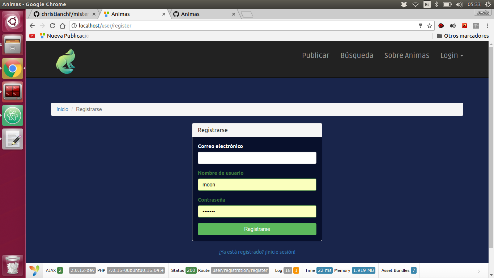
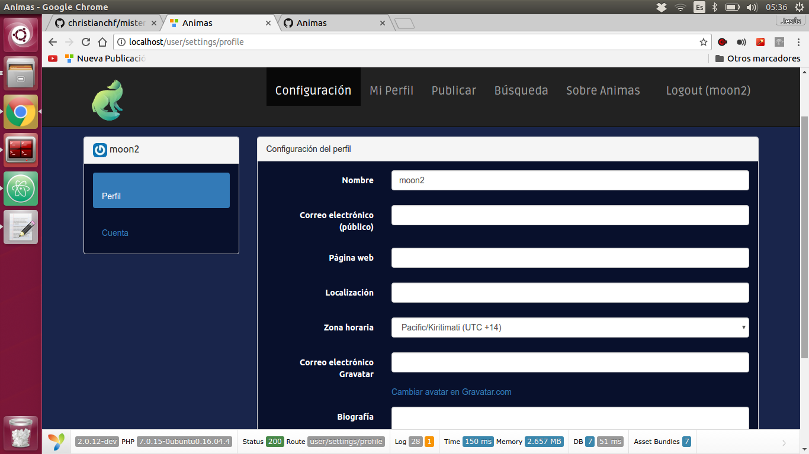
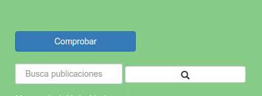

Manual básico de usuario
========================================

En este manual básico de usuario sobre la plataforma Animas se van a tratar los siguientes aspectos:

Registrarse
-----------------------

Para registrarnos en la aplicación, primero tenemos que pulsar en la opción del menú "Login" y después en la opción "Registrarse". Esta opción nos llevara a un formulario de registro. En el que tendremos que rellenar los campos que aparecen para registrarnos en la aplicación.

-----------------------------------------------
Login
------------------------

Una vez nos hayamos registrado en la aplicación podremos loguearnos. Esta acción la realizaremos desde el formulario al que se nos redireccionará o desde la opción del menú de "Login", en la opción "Loguearse".

-----------------------------------------------
Logout
-----------------------

Cerrar sesión es tan sencillo como pulsar sobre la opción de logout que aparecerá en el menú de "Login" cuando estemos logueados.

-----------------------------------------------
Ver información de usuario
-----------------------

Para ver los datos de usuario, tienes que estar registrado y logueado. Luego, en le menú de navegación acceder a la opción de "Mi Perfil" de esta manera, estás accediendo a tu información.
Si por el contrario deseas acceder a la información de otro usuario, con tan solo pulsar en el nombre de usuario que aparece en cada anuncio, estarás accediendo a los datos de ese usuario.

-----------------------------------------------
Modificar datos de usuario
--------------------------

Para modificar los datos de usuario, debes estar registrado y logueado. Una vez efectuada dichas acciones, debes de acceder a la opción de "Configuración" que se encuentra en el menú de navegación. Una vez dentro accede a "Cuenta", ubicado en el panel de la izquierda, donde se se encuentran tus datos de registro como el nombre de usuario.De esta manera estarás accediendo a la modificación de tus datos.

Si por el contrario deseas añadir información adicional a perfil. Deberás acceder a "Perfil", ubicado en el panel de la izquierda

-----------------------------------------------
Eliminar datos de usuario
--------------------------
Para borrar los datos del usuario debes estar registrado y logueado. Una vez efectuada dichas acciones, debes de acceder a la opción de "Configuración" que se encuentra en el menú de navegación. En la parte inferior de la página encontrarás la opción de "Borrar cuenta". De esta manera estarás borrando tus datos y tu registro en la aplicación.

-----------------------------------------------
Crear una Publicación
--------------------------

Para crear una publicación debes estar registrado y logueado. Una vez realizadas dichas acciones, el usuario debe acceder a la opción de "Publicar" que se encuentra en el menú de navegación. Accederás a un formulario donde el usuario debe completar el "título": un breve resumen o síntesis del contenido de la publicación, el "cuerpo": el contenido de la información textual de la publicación, el "teléfono de contacto": deberás facilitar un teléfono de contacto para los usuarios interesados en tu publicación. El campo de "Enlace" no es obligatorio, es información adicional en relación a la publicación que el usuario puede ofrecer.

Con respecto a las listas desplegables que se encuentran en la parte inferior del formulario las cuelas son "categoría" y "tipo", el usuario deberá seleccionar a qué categoría pertenece su publicación y el tipo de animal al que se relaciona dicha publicación.

Por útlimo, para crear la publicación el usuario debe chequear el campo de haber leído las "normas de publicación" que se encuentran justo antes del botón "Publicar". Una vez chequeado el campo, el botón para publicar estará disponible.

Cuando una publicación ha sido creada aparecerá en forma de anuncio listada junto a otras publicaciones en la página principal.

-----------------------------------------------
Modificar y Borrar una Publicación
--------------------------

Para modificar y borrar una publicación el usuario debe de estar previamente registrado y logueado y además ser el creador de dicha publicación. Una vez completado lo anterior, el usuario podrá acceder a la información completa de la publicación a través del título o la imagen (ambas son enlaces a la información completa de la publicación ) que se encuentra en dicha publicación anunciada en la página principal.

Cuando accedemos la vista de información completa de la publicación encontraremos en la parte superior de la página dos botones que marcan "Modificar" y "Borrar", de esta manera se modifican o se borran los datos de la publicación accedida.

-----------------------------------------------
Reportar una publicación
--------------------------
Para hacer un reporte a una publicación debes estar registrado y logueado, una vez completada estas acciones, el usuario puede reportar una publicación accediendo al botón de "Reportar Usuario" que se encuentra en una publicación anunciada de la página principal.

-----------------------------------------------
Buscar una publicación
--------------------------
Un usuario que acceda a la aplicación puede buscar publicaciones filtrando por "tipos" y/o por "categoría". Para dicha búsqueda el usuario debe acceder a la opción de "Búsqueda" ubicada en el menú de navegación. De esta manera accedemos a una página que nos da las opciones de "categorías" y "tipos" en forma de chequéos. Una vez que el usuario haya chequeado las "categorías" y "tipos" de su interés, aparecerá una lista de publicaciones filtradas automáticamente según sus opciones seleccionadas.

---------------------------------------------
Comprobar una publicación
--------------------------
Un usuario puede comprobar una publicación pulsando el botón de comprobar ubicado en la parte superior izquierda de la página principal. Una vez pulsado el botón se accederá a una página donde por defecto se filtran publicaciones listadas según el rango de distancia que tienen con las publicaciones con el usuario actual. Por defecto es 1km, pero el rango es modificable para atender a las necesidades del usuario.

---------------------------------------------
Búsqueda concreta de publicación
--------------------------
Cuando un usuario requiere buscar un aspecto o elemento concreto de una publicación, así como por ejemplo una palabra específica. El usuario deberá acceder al cuadro de búsqueda que se encuentra en la parte superior de la página principal, bajo el botón de comprobar.

---------------------------------------------
Modificar localización de la publicación
--------------------------
Cuando un usuario requiere modificar el punto de localización de una publicación que ofrece el servicio de geolocalización. Puede modificar fácilmente su ubicación de la misma arrastrando el señalizador del mapa. Automáticamente se guardará el punto hacia donde ha sido desplazado.

---------------------------------------------
Más Sobre Animas
--------------------------

Si el usuario no encuentra una opción o necesidad que pueda ofrecer la web, deberá dirigirse al menú de navegación y acceder a la opción "Sobre Animas", En ella encontrará información sobre el "proyecto Animas" y su uso.

