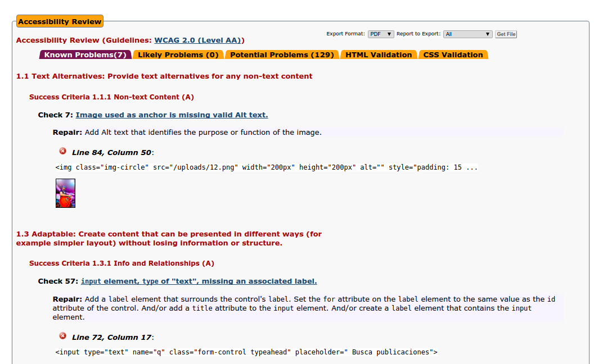
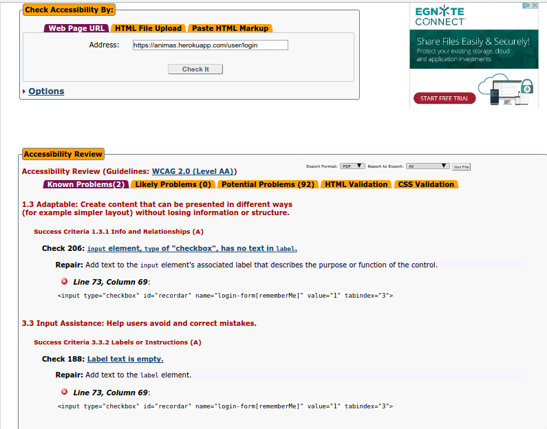
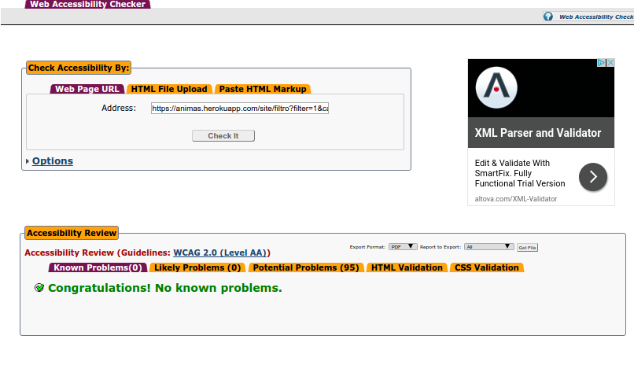

Anexo IV: Validación accesibilidad
========================

La validación sobre accesibilidad se ha llevado a cabo sobre las siguientes páginas:

[Index](http://animas.herokuapp.com/index.php)
---------

En este apartado se muetran fallos alts en las imágenes y label y en los checkbox. Se puede solucionar con facilidad y cumple el nivel AA

Tras crear una publicación, el propio framework (Yii2) generá automáticamente una etiqueta  `<b>` que no puede ser reemplazada o eliminada

-------------------------------------------------

[Login](http://animas.herokuapp.com/user/login.php)
---------

La sección de "Login" presenta dos fallo que representan la falta de un label en un checkbox en un input de texto. Aún así, aunque a nivel de código presente un fallo de accesibilidad, se mantiene informado en todo momento al usuario de la acción de dicho checkbox. Este fallo, el cual es generado por el propio framework, no es accesible mediante código HTML o CSS
-------------------------------------------------

[Registro](http://animas.herokuapp.com/user/register.php)
---------

La página del registro cumple el nivel AA de accesibilidad.

-------------------------------------------------

[Publicar](https://animas.herokuapp.com/publicaciones/create.php)
---------

La sección de "Publicar" mediante un formulario presenta dos fallo que representan la falta de un label en un checkbox en un input de texto. Aún así, aunque a nivel de código presente un fallo de accesibilidad, se mantiene informado en todo momento al usuario de la acción de dicho checkbox. Este fallo, el cual es generado por el propio framework, no es accesible mediante código HTML o CSS

-------------------------------------------------

[Información publicación](http://animas.herokuapp.com/index.php)
"Accediendo mediante mediante el título o imágen de las publicacioens listadas en el index"
---------

A priori, la página presentaba fallos de accesibilidad, Como por ejemplo etiquetas `</i>` que deben ser reemplazadas por `</strong>`.

-------------------------------------------------

[Búsqueda Filtrada](http://animas.herokuapp.com/site/filtro)
---------
La página cumple el con el nivel de accesibilidad AA

-------------------------------------------------

[Búsqueda Filtrada](http://animas.herokuapp.com/site/filtro)
---------
La página cumple el con el nivel de accesibilidad AA

-------------------------------------------------

[Contacto](http://animas.herokuapp.com/site/contact)
---------
La página cumple el con el nivel de accesibilidad AA

-------------------------------------------------

[Mi Perfil](http://animas.herokuapp.com/user/14)
---------
La página cumple el con el nivel de accesibilidad AA

-------------------------------------------------

Conclusión
-----------------

En coclusión, las mayoría de páginas cumplen las normas de accesibilidad AA, tan solo en algunas secciones no se ha podido completar el nivel de accesiblidad AA debido a etiquetas que genera el propio framework.
