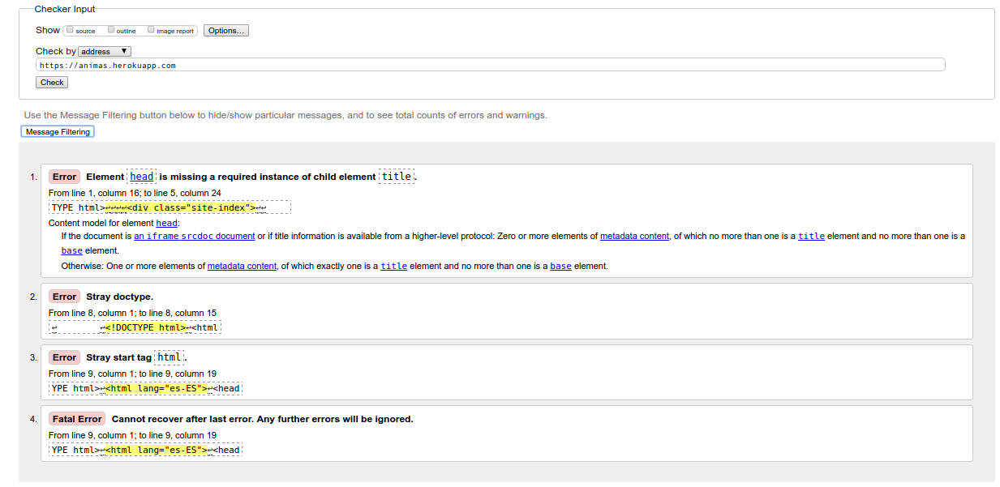

Anexo III: Validación HTML
========================

La validación html se ha llevado a cabo sobre las siguientes páginas:

[Index](http://animas.herokuapp.com/index.php)

En la página principal podemos encontrar cuatro errores los cuales son causados por el el framework de php (Yii2). Pero no existen errores de código a nivel de código escrito

---------

-------------------------------------------------

[Login](http://animas.herokuapp.com/user/login)

En la página principal podemos encontrar cuatro errores los cuales son causados por el el framework de php (Yii2). Pero no existen errores de código a nivel de código escrito

---------

-------------------------------------------------

[Publicación](http://animas.herokuapp.com/publicaciones/create)

En la página principal podemos encontrar cuatro errores los cuales son causados por el el framework de php (Yii2). Pero no existen errores de código a nivel de código escrito

---------

-------------------------------------------------

[Registro](http://animas.herokuapp.com/user/register)

En la página principal podemos encontrar cuatro errores los cuales son causados por el el framework de php (Yii2). Pero no existen errores de código a nivel de código escrito

---------

